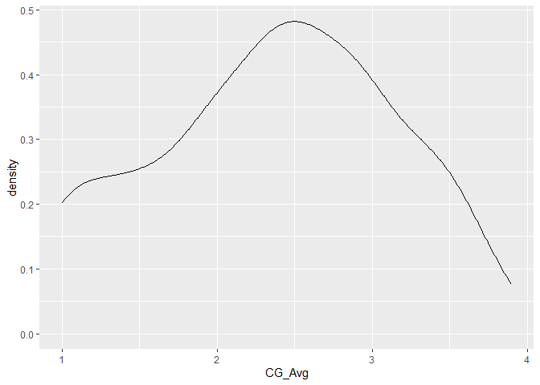

Machine_Learning_SCRI_ROOT_SNPs
================
Houston Saxe
1/26/2022

``` r
pacman::p_load(tidyr, 
               dplyr,
               tibble, 
               caret, 
               mlbench,
               caTools,
               mlr,
               randomForest,
               data.table,
               stringr)
```

## Machine learning

### Get SNP data

``` r
M = fread('../SCRI_ROOT_SNPs_cleaned.csv')
```

# Read in rfe results

``` r
rfe_res_all = readRDS('../rfe_results_NEM_2and3_year_length_2and3_year_CG_PHY.RData')
```

# Get NEM phenotype data

``` r
NEM_pheno = fread('C:/Users/hsaxe/OneDrive/Documents/ALAB/GitHub/SCRI_ROOT_2/SCRI_Phenotype_Analysis/2_3_Year_RLN_Counts_and_tree_lengths.csv') %>% 
  mutate(CAL_Wip_ID = gsub(' ', '', CAL_Wip_ID) %>% 
           gsub('-', '_', .))

NEM_pheno %>% 
  filter(CAL_Wip_ID %like% 'MS1.36|MS1.41|MS1.56|MS1.122')
```

    ##    CAL_Wip_ID genotype Female_Parent length_2Y RLN_2Y length_3Y RLN_3Y
    ## 1:     MS1_36   MS1 36         31.01     24.33   1.29     37.50   34.1
    ## 2:     MS1_41   MS1 41         31.01    117.50 247.80    139.56   63.9
    ## 3:     MS1_56   MS1 56         31.01     44.33  16.40     44.94   13.0
    ## 4:    MS1_122  MS1 122         31.01    149.33   3.70    173.00   68.9
    ##    Over_length_3Y Over_RLN_3Y
    ## 1:             NA          NA
    ## 2:             NA          NA
    ## 3:             NA          NA
    ## 4:         100.56        26.7

``` r
# CAL_Wip_ID, length_2Y, RLN_2Y, length_3Y, RLN_3Y
```

### 2Y.RLN Merge with SNP data

``` r
datNEM_2YRLN = M %>% 
  left_join(dplyr::select(NEM_pheno, CAL_Wip_ID, RLN_2Y), 
            by = c('Hybrid' = names(NEM_pheno)[1])) %>% 
  relocate(RLN_2Y)

length(datNEM_2YRLN$RLN_2Y[is.na(datNEM_2YRLN$RLN_2Y) == T])
```

    ## [1] 96

#### Drop NAs

``` r
datNEM_2YRLN = datNEM_2YRLN %>% 
  drop_na()
```

#### What are the most important QTLs for 2Y.RLN?

``` r
rfedat = datNEM_2YRLN %>%
  dplyr::select(!Hybrid) %>%
  mutate(across(.cols = everything(), as.numeric))

ctrl <- rfeControl(functions = rfFuncs,
                   method = "repeatedcv",
                   repeats = 5,
                   verbose = FALSE)

# res_NEM_2YRLN = rfe(RLN_2Y ~ ., rfedat, rfeControl = ctrl)
# 
# rfe_res_all$TwoY_RLN = res_NEM_2YRLN

res_NEM_2YRLN = rfe_res_all$TwoY_RLN
```

#### Distribution of phenotype data

``` r
ggplot(datNEM_2YRLN, aes(RLN_2Y))+
 geom_density()
```

<!-- -->

#### NEM ML model for predicting resistance

``` r
## Train model based on rfe results
## Create binary classifier based on some threshold for prediction
set = datNEM_2YRLN %>% 
  dplyr::select(Hybrid, RLN_2Y, contains("31.01")) %>%
  mutate(Hybrid = factor(Hybrid), NEM = factor(ifelse(RLN_2Y <= 100,
                                                      "R",
                                                      "S"))) %>%
  na.omit() %>%
  dplyr::select(!RLN_2Y) %>%
  relocate(NEM)

## Set random number generator seed for splitting data
set.seed(1)

## Make 80/20 data split for training/testing
rows = createDataPartition(set$NEM, times = 1, p = 0.8, list = F)

train = set[rows,]

test = set[-rows,]

## Set random number generator seed for training model
set.seed(1)

mod = caret::train(as.formula(paste('NEM' ,
                                    paste(res_NEM_2YRLN$optVariables, collapse = ' + '),
                                    sep = ' ~ ')),
                   data = train)

mod
```

    ## Random Forest 
    ## 
    ## 206 samples
    ##   4 predictor
    ##   2 classes: 'R', 'S' 
    ## 
    ## No pre-processing
    ## Resampling: Bootstrapped (25 reps) 
    ## Summary of sample sizes: 206, 206, 206, 206, 206, 206, ... 
    ## Resampling results across tuning parameters:
    ## 
    ##   mtry  Accuracy   Kappa        
    ##   2     0.9085333  -0.0031830239
    ##   3     0.9019755   0.0038976843
    ##   4     0.8998697   0.0004807666
    ## 
    ## Accuracy was used to select the optimal model using the largest value.
    ## The final value used for the model was mtry = 2.

``` r
p = predict.train(mod, test)

cmat = confusionMatrix(p, test$NEM)

cmat
```

    ## Confusion Matrix and Statistics
    ## 
    ##           Reference
    ## Prediction  R  S
    ##          R 47  4
    ##          S  0  0
    ##                                           
    ##                Accuracy : 0.9216          
    ##                  95% CI : (0.8112, 0.9782)
    ##     No Information Rate : 0.9216          
    ##     P-Value [Acc > NIR] : 0.6289          
    ##                                           
    ##                   Kappa : 0               
    ##                                           
    ##  Mcnemar's Test P-Value : 0.1336          
    ##                                           
    ##             Sensitivity : 1.0000          
    ##             Specificity : 0.0000          
    ##          Pos Pred Value : 0.9216          
    ##          Neg Pred Value :    NaN          
    ##              Prevalence : 0.9216          
    ##          Detection Rate : 0.9216          
    ##    Detection Prevalence : 1.0000          
    ##       Balanced Accuracy : 0.5000          
    ##                                           
    ##        'Positive' Class : R               
    ## 

``` r
ML_res = data.frame(RLN_2Y = cmat$overall) %>% 
  bind_rows(data.frame(RLN_2Y = cmat$byClass)) %>% 
  slice(1:6, 8, 9) 

ML_res =  bind_cols(ML_res)

# epr = extractProb(models = list(mod = mod), testX = test)
# 
# # barplot(table(train$CG))
# 
# summary(train$CG)/length(train$CG)
# 
# p3 = predict(mod, test, type = "prob")
```

### 3Y.RLN Merge with SNP data

``` r
datNEM_3YRLN = M %>% 
  left_join(dplyr::select(NEM_pheno, CAL_Wip_ID, RLN_3Y),
            by = c('Hybrid' = names(NEM_pheno)[1])) %>% 
  relocate(RLN_3Y)

length(datNEM_3YRLN$RLN_3Y[is.na(datNEM_3YRLN$RLN_3Y) == T])
```

    ## [1] 110

``` r
NEM_missing = datNEM_3YRLN %>% 
  filter(is.na(RLN_3Y))

fwrite(NEM_missing %>% dplyr::select(RLN_3Y, Hybrid), '../Missing_NEM_Phenotypes.csv')
```

#### Drop NAs

``` r
datNEM_3YRLN = datNEM_3YRLN %>% 
  drop_na()
```

``` r
# rfe_res_all = list()
```

#### What are the most important QTLs for 3Y.RLN?

``` r
rfedat = datNEM_3YRLN %>%
  dplyr::select(!Hybrid) %>%
  mutate(across(.cols = everything(), as.numeric))

ctrl <- rfeControl(functions = rfFuncs,
                   method = "repeatedcv",
                   repeats = 5,
                   verbose = FALSE)

# res_NEM_3YRLN = rfe(RLN_3Y ~ ., rfedat, rfeControl = ctrl)

# rfe_res_all$ThreeY_RLN = res_NEM_3YRLN

res_NEM_3YRLN = rfe_res_all$ThreeY_RLN
```

#### Distribution of phenotype data

``` r
ggplot(datNEM_3YRLN, aes(RLN_3Y))+
 geom_density()
```

<!-- -->

#### Distribution of phenotype data

``` r
# set = datNEM_3YRLN %>% 
#   dplyr::select(Hybrid, RLN_3Y, contains("31.01")) %>%
#   mutate(Hybrid = factor(Hybrid), NEM = factor(ifelse(RLN_3Y <=15,
#                                                       "R",
#                                                       "S"))) %>%
#   na.omit() %>%
#   dplyr::select(!RLN_3Y) %>%
#   relocate(NEM)
# 
# set2 = set %>% 
#          dplyr::select(NEM, res_NEM_3YRLN$optVariables) %>% 
#          pivot_longer(!NEM, names_to = 'SNP')
# 
# ggplot(set2, aes(value, value, fill = NEM))+
#  geom_col()+
#   facet_wrap(NEM~SNP, ncol = 4)
```

``` r
# glm = glm(as.formula(paste('NEM' , 
#                            paste(res_NEM_3YRLN$optVariables, collapse = ' + '),
#                            sep = ' ~ ')),
#     data = set %>% 
#          dplyr::select(NEM, res_NEM_3YRLN$optVariables),
#     family = binomial)
# 
# summary(glm)
```

#### NEM ML model for predicting resistance

``` r
## Train model based on rfe results
## Create binary classifier based on some threshold for prediction
set = datNEM_3YRLN %>% 
  dplyr::select(Hybrid, RLN_3Y, contains("31.01")) %>%
  mutate(Hybrid = factor(Hybrid), NEM = factor(ifelse(RLN_3Y <= 68,
                                                      "R", 
                                                      "S"))) %>%
  na.omit() %>%
  dplyr::select(!RLN_3Y) %>%
  relocate(NEM)

## Set random number generator seed for splitting data
set.seed(1)

## Make 60/40 data split for training/testing
rows = createDataPartition(set$NEM, times = 1, p = 0.8, list = F)

train = set[rows,]

test = set[-rows,]

## Set random number generator seed for training model
set.seed(1)

mod = caret::train(as.formula(paste('NEM' , 
                                    paste(res_NEM_3YRLN$optVariables, collapse = ' + '),
                                    sep = ' ~ ')),
                   data = train)

mod
```

    ## Random Forest 
    ## 
    ## 196 samples
    ##   4 predictor
    ##   2 classes: 'R', 'S' 
    ## 
    ## No pre-processing
    ## Resampling: Bootstrapped (25 reps) 
    ## Summary of sample sizes: 196, 196, 196, 196, 196, 196, ... 
    ## Resampling results across tuning parameters:
    ## 
    ##   mtry  Accuracy   Kappa    
    ##   2     0.5719609  0.1497724
    ##   3     0.5703670  0.1466795
    ##   4     0.5685847  0.1437402
    ## 
    ## Accuracy was used to select the optimal model using the largest value.
    ## The final value used for the model was mtry = 2.

``` r
p = predict.train(mod, test)

cmat = confusionMatrix(p, test$NEM)

cmat
```

    ## Confusion Matrix and Statistics
    ## 
    ##           Reference
    ## Prediction  R  S
    ##          R 12  3
    ##          S 12 20
    ##                                           
    ##                Accuracy : 0.6809          
    ##                  95% CI : (0.5288, 0.8091)
    ##     No Information Rate : 0.5106          
    ##     P-Value [Acc > NIR] : 0.01363         
    ##                                           
    ##                   Kappa : 0.3666          
    ##                                           
    ##  Mcnemar's Test P-Value : 0.03887         
    ##                                           
    ##             Sensitivity : 0.5000          
    ##             Specificity : 0.8696          
    ##          Pos Pred Value : 0.8000          
    ##          Neg Pred Value : 0.6250          
    ##              Prevalence : 0.5106          
    ##          Detection Rate : 0.2553          
    ##    Detection Prevalence : 0.3191          
    ##       Balanced Accuracy : 0.6848          
    ##                                           
    ##        'Positive' Class : R               
    ## 

``` r
ML_res = data.frame(X3_RLN = cmat$overall) %>% 
  bind_rows(data.frame(X3_RLN = cmat$byClass)) %>% 
  slice(1:6, 8, 9) %>% 
  bind_cols(ML_res)

# epr = extractProb(models = list(mod = mod), testX = test)
# 
# # barplot(table(train$CG))
# 
# summary(train$CG)/length(train$CG)
# 
# p3 = predict(mod, test, type = "prob")
```

## Phenotype distribution without selection

``` r
no_predictions_NEM = test %>%
  dplyr::select(Hybrid, NEM) %>% 
  mutate(Predictions = p) %>% 
  relocate(Predictions) %>% 
  left_join(NEM_pheno, by = c('Hybrid' = 'CAL_Wip_ID'))

ggplot(no_predictions_NEM, aes(RLN_3Y))+
 geom_density()
```

<!-- -->

## Phenotype distribution after selection

``` r
predictions_NEM = test %>%
  dplyr::select(Hybrid, NEM) %>% 
  mutate(Predictions = p) %>% 
  relocate(Predictions) %>% 
  filter(Predictions == 'R') %>% 
  left_join(NEM_pheno, by = c('Hybrid' = 'CAL_Wip_ID'))

ggplot(predictions_NEM, aes(RLN_3Y))+
 geom_density()
```

<!-- -->

## Stats of selection vs no selection

``` r
predicted_proportions_NEM = predictions_NEM %>%
  mutate(mean_phenotype = mean(RLN_3Y)) %>% 
  group_by(NEM) %>%
  summarise(n = n(),
            mean_phenotype = mean_phenotype) %>% 
  distinct() %>% 
  # count(NEM) %>%
  pivot_wider(names_from = NEM, 
              values_from = c(n, mean_phenotype)) %>% 
  mutate(Percent_R = n_R/(n_R+n_S),
         Method = 'Predictions')
```

    ## Warning: Returning more (or less) than 1 row per `summarise()` group was deprecated in
    ## dplyr 1.1.0.
    ## ℹ Please use `reframe()` instead.
    ## ℹ When switching from `summarise()` to `reframe()`, remember that `reframe()`
    ##   always returns an ungrouped data frame and adjust accordingly.
    ## Call `lifecycle::last_lifecycle_warnings()` to see where this warning was
    ## generated.

    ## `summarise()` has grouped output by 'NEM'. You can override using the `.groups`
    ## argument.

``` r
Proportion_stats_NEM = datNEM_3YRLN %>% 
  dplyr::select(Hybrid, RLN_3Y) %>% 
  mutate(Hybrid = factor(Hybrid), 
         NEM = factor(ifelse(RLN_3Y <= 68,
                             "R", 
                             "S")),
         mean_phenotype = mean(RLN_3Y)) %>% 
  na.omit() %>%
  group_by(NEM) %>%
  summarise(n = n(),
            mean_phenotype = mean_phenotype) %>% 
  distinct() %>% 
  pivot_wider(names_from = NEM, 
              values_from = c(n, mean_phenotype)) %>% 
   mutate(Percent_R = n_R/(n_R+n_S),
         Method = 'No Predictions') %>% 
  rbind(predicted_proportions_NEM)
```

    ## Warning: Returning more (or less) than 1 row per `summarise()` group was deprecated in
    ## dplyr 1.1.0.
    ## ℹ Please use `reframe()` instead.
    ## ℹ When switching from `summarise()` to `reframe()`, remember that `reframe()`
    ##   always returns an ungrouped data frame and adjust accordingly.
    ## Call `lifecycle::last_lifecycle_warnings()` to see where this warning was
    ## generated.

    ## `summarise()` has grouped output by 'NEM'. You can override using the `.groups`
    ## argument.

``` r
Proportion_stats_NEM
```

    ## # A tibble: 2 × 6
    ##     n_R   n_S mean_phenotype_R mean_phenotype_S Percent_R Method        
    ##   <int> <int>            <dbl>            <dbl>     <dbl> <chr>         
    ## 1   124   119            109.             109.      0.510 No Predictions
    ## 2    12     3             46.9             46.9     0.8   Predictions

## Fisher’s exact test of predictions vs no predictions, 3.82 times more likely to get a resistant individual with predictions vs no predictions

``` r
Proportion_stats_NEM %>% 
  arrange(desc(Method)) %>% 
  column_to_rownames(var = 'Method') %>% 
  dplyr::select(n_R, n_S) %>%
  as.matrix()
```

    ##                n_R n_S
    ## Predictions     12   3
    ## No Predictions 124 119

``` r
Proportion_stats_NEM %>% 
  arrange(desc(Method)) %>% 
  dplyr::select(n_R, n_S) %>%
  as.matrix() %>% 
  fisher.test()
```

    ## 
    ##  Fisher's Exact Test for Count Data
    ## 
    ## data:  .
    ## p-value = 0.03387
    ## alternative hypothesis: true odds ratio is not equal to 1
    ## 95 percent confidence interval:
    ##   0.9971647 21.6202051
    ## sample estimates:
    ## odds ratio 
    ##   3.820715

### 2Y.length Merge with SNP data

``` r
datNEM_2Ylength = M %>% 
  left_join(dplyr::select(NEM_pheno, CAL_Wip_ID, length_2Y), 
            by = c('Hybrid' = names(NEM_pheno)[1])) %>% 
  relocate(length_2Y)

length(datNEM_2Ylength$length_2Y[is.na(datNEM_2Ylength$length_2Y) == T])
```

    ## [1] 168

#### Drop NAs

``` r
datNEM_2Ylength = datNEM_2Ylength %>% 
  drop_na()
```

#### What are the most important QTLs for 2Y.length?

``` r
rfedat = datNEM_2Ylength %>%
  dplyr::select(!Hybrid) %>%
  mutate(across(.cols = everything(), as.numeric))

ctrl <- rfeControl(functions = rfFuncs,
                   method = "repeatedcv",
                   repeats = 5,
                   verbose = FALSE)

# res_NEM_2Ylength = rfe(length_2Y ~ ., rfedat, rfeControl = ctrl)
# 
# rfe_res_all$TwoY_length = res_NEM_2Ylength

res_NEM_2Ylength = rfe_res_all$TwoY_length
```

#### Distribution of phenotype data

``` r
datNEM_2Ylength = datNEM_2Ylength %>% 
  mutate(Mother = str_extract(Hybrid, 'MS1|AC'))

ggplot(datNEM_2Ylength, aes(length_2Y, color = Mother))+
 geom_density()
```

<!-- -->

#### 2Ylength ML model for predicting resistance

``` r
## Train model based on rfe results
## Create binary classifier based on some threshold for prediction
set = datNEM_2Ylength %>% 
  dplyr::select(Hybrid, length_2Y, contains("31.01")) %>%
  mutate(Hybrid = factor(Hybrid), NEM = factor(ifelse(length_2Y >= 75,
                                                      "Tall",
                                                      "Short"))) %>%
  na.omit() %>%
  dplyr::select(!length_2Y) %>%
  relocate(NEM)

## Set random number generator seed for splitting data
set.seed(1)

## Make 60/40 data split for training/testing
rows = createDataPartition(set$NEM, times = 1, p =0.8, list = F)

train = set[rows,]

test = set[-rows,]

## Set random number generator seed for training model
set.seed(1)

mod = caret::train(as.formula(paste('NEM' , 
                                    paste(res_NEM_2Ylength$optVariables, collapse = ' + '),
                                    sep = ' ~ ')),
                   data = train)

mod
```

    ## Random Forest 
    ## 
    ## 149 samples
    ##   4 predictor
    ##   2 classes: 'Short', 'Tall' 
    ## 
    ## No pre-processing
    ## Resampling: Bootstrapped (25 reps) 
    ## Summary of sample sizes: 149, 149, 149, 149, 149, 149, ... 
    ## Resampling results across tuning parameters:
    ## 
    ##   mtry  Accuracy   Kappa    
    ##   2     0.8806033  0.7565490
    ##   3     0.8681096  0.7310868
    ##   4     0.8524546  0.7025970
    ## 
    ## Accuracy was used to select the optimal model using the largest value.
    ## The final value used for the model was mtry = 2.

``` r
p = predict.train(mod, test)

cmat = confusionMatrix(p, test$NEM)

cmat
```

    ## Confusion Matrix and Statistics
    ## 
    ##           Reference
    ## Prediction Short Tall
    ##      Short    14    2
    ##      Tall      1   19
    ##                                           
    ##                Accuracy : 0.9167          
    ##                  95% CI : (0.7753, 0.9825)
    ##     No Information Rate : 0.5833          
    ##     P-Value [Acc > NIR] : 1.104e-05       
    ##                                           
    ##                   Kappa : 0.8302          
    ##                                           
    ##  Mcnemar's Test P-Value : 1               
    ##                                           
    ##             Sensitivity : 0.9333          
    ##             Specificity : 0.9048          
    ##          Pos Pred Value : 0.8750          
    ##          Neg Pred Value : 0.9500          
    ##              Prevalence : 0.4167          
    ##          Detection Rate : 0.3889          
    ##    Detection Prevalence : 0.4444          
    ##       Balanced Accuracy : 0.9190          
    ##                                           
    ##        'Positive' Class : Short           
    ## 

``` r
ML_res = data.frame(length_2Y = cmat$overall) %>% 
  bind_rows(data.frame(length_2Y = cmat$byClass)) %>% 
  slice(1:6, 8, 9) %>% 
  bind_cols(ML_res)

# epr = extractProb(models = list(mod = mod), testX = test)
# 
# # barplot(table(train$CG))
# 
# summary(train$CG)/length(train$CG)
# 
# p3 = predict(mod, test, type = "prob")
```

### 3Y.length Merge with SNP data

``` r
datNEM_3Ylength = M %>% 
  left_join(dplyr::select(NEM_pheno, CAL_Wip_ID, length_3Y),
            by = c('Hybrid' = names(NEM_pheno)[1])) %>% 
  relocate(length_3Y)

length(datNEM_3Ylength$length_3Y[is.na(datNEM_3Ylength$length_3Y) == T])
```

    ## [1] 106

#### Drop NAs

``` r
datNEM_3Ylength = datNEM_3Ylength %>% 
  drop_na()
```

#### What are the most important QTLs for 3Y.length?

``` r
rfedat = datNEM_3Ylength %>%
  dplyr::select(!Hybrid) %>%
  mutate(across(.cols = everything(), as.numeric))

ctrl <- rfeControl(functions = rfFuncs,
                   method = "repeatedcv",
                   repeats = 5,
                   verbose = FALSE)

# res_NEM_3Ylength = rfe(length_3Y ~ ., rfedat, rfeControl = ctrl)
# 
# rfe_res_all$ThreeY_length = res_NEM_3Ylength

res_NEM_3Ylength = rfe_res_all$ThreeY_length

res_NEM_3Ylength$optVariables = res_NEM_3Ylength$optVariables[1:5]
```

#### Distribution of phenotype data

``` r
ggplot(datNEM_3Ylength, aes(length_3Y))+
 geom_density()
```

<!-- -->

#### Length_3Y ML model for predicting resistance

``` r
## Train model based on rfe results
## Create binary classifier based on some threshold for prediction
set = datNEM_3Ylength %>% 
  dplyr::select(Hybrid, length_3Y, contains("31.01")) %>%
  mutate(Hybrid = factor(Hybrid),
         Length_3Y = factor(ifelse(length_3Y >= 100, 
                                                      "Tall",
                                                      "Short"))) %>%
  na.omit() %>%
  dplyr::select(!length_3Y) %>%
  relocate(Length_3Y)

## Set random number generator seed for splitting data
set.seed(1)

## Make 60/40 data split for training/testing
rows = createDataPartition(set$Length_3Y, times = 1, p = 0.8, list = F)

train = set[rows,]

test = set[-rows,]

## Set random number generator seed for training model
set.seed(1)

mod = caret::train(as.formula(paste('Length_3Y' ,
                                    paste(res_NEM_3Ylength$optVariables, collapse = ' + '),
                                    sep = ' ~ ')),
                   data = train)

mod
```

    ## Random Forest 
    ## 
    ## 199 samples
    ##   5 predictor
    ##   2 classes: 'Short', 'Tall' 
    ## 
    ## No pre-processing
    ## Resampling: Bootstrapped (25 reps) 
    ## Summary of sample sizes: 199, 199, 199, 199, 199, 199, ... 
    ## Resampling results across tuning parameters:
    ## 
    ##   mtry  Accuracy   Kappa    
    ##   2     0.7959887  0.5724634
    ##   3     0.7916014  0.5626690
    ##   5     0.7926607  0.5660838
    ## 
    ## Accuracy was used to select the optimal model using the largest value.
    ## The final value used for the model was mtry = 2.

``` r
p = predict.train(mod, test)

cmat = confusionMatrix(p, test$Length_3Y)

cmat
```

    ## Confusion Matrix and Statistics
    ## 
    ##           Reference
    ## Prediction Short Tall
    ##      Short    13    4
    ##      Tall      7   24
    ##                                           
    ##                Accuracy : 0.7708          
    ##                  95% CI : (0.6269, 0.8797)
    ##     No Information Rate : 0.5833          
    ##     P-Value [Acc > NIR] : 0.005226        
    ##                                           
    ##                   Kappa : 0.5182          
    ##                                           
    ##  Mcnemar's Test P-Value : 0.546494        
    ##                                           
    ##             Sensitivity : 0.6500          
    ##             Specificity : 0.8571          
    ##          Pos Pred Value : 0.7647          
    ##          Neg Pred Value : 0.7742          
    ##              Prevalence : 0.4167          
    ##          Detection Rate : 0.2708          
    ##    Detection Prevalence : 0.3542          
    ##       Balanced Accuracy : 0.7536          
    ##                                           
    ##        'Positive' Class : Short           
    ## 

``` r
ML_res = data.frame(length_3Y = cmat$overall) %>% 
  bind_rows(data.frame(length_3Y = cmat$byClass)) %>% 
  slice(1:6, 8, 9) %>% 
  bind_cols(ML_res)

# epr = extractProb(models = list(mod = mod), testX = test)
# 
# # barplot(table(train$CG))
# 
# summary(train$CG)/length(train$CG)
# 
```

``` r
# library(verification)

p3 = predict.train(mod, test, type = "prob")

p3
```

    ##    Short  Tall
    ## 1  1.000 0.000
    ## 2  1.000 0.000
    ## 3  1.000 0.000
    ## 4  0.000 1.000
    ## 5  0.000 1.000
    ## 6  0.000 1.000
    ## 7  0.000 1.000
    ## 8  0.000 1.000
    ## 9  0.000 1.000
    ## 10 1.000 0.000
    ## 11 0.000 1.000
    ## 12 0.000 1.000
    ## 13 0.832 0.168
    ## 14 1.000 0.000
    ## 15 0.000 1.000
    ## 16 0.000 1.000
    ## 17 1.000 0.000
    ## 18 0.000 1.000
    ## 19 0.000 1.000
    ## 20 0.000 1.000
    ## 21 0.000 1.000
    ## 22 0.000 1.000
    ## 23 0.000 1.000
    ## 24 0.000 1.000
    ## 25 0.000 1.000
    ## 26 0.000 1.000
    ## 27 0.530 0.470
    ## 28 0.000 1.000
    ## 29 1.000 0.000
    ## 30 0.530 0.470
    ## 31 1.000 0.000
    ## 32 0.000 1.000
    ## 33 0.000 1.000
    ## 34 1.000 0.000
    ## 35 1.000 0.000
    ## 36 0.000 1.000
    ## 37 0.530 0.470
    ## 38 0.000 1.000
    ## 39 0.000 1.000
    ## 40 0.832 0.168
    ## 41 0.530 0.470
    ## 42 0.000 1.000
    ## 43 0.000 1.000
    ## 44 0.000 1.000
    ## 45 0.000 1.000
    ## 46 1.000 0.000
    ## 47 0.000 1.000
    ## 48 0.000 1.000

``` r
df2 = data.frame(probs = p3, 
                 labels = test$Length_3Y,
                 predictions = p) %>% 
  mutate(predictions_N = ifelse(predictions == 'Short', 1, 0),
         labels_N = ifelse(labels == 'Short', 1, 0))

# library(ROCR)
# 
# pred2 = prediction(df2$probs.Short, df2$labels_N)
# 
# perf2 = performance(pred2, 'tpr', 'fpr')
# 
# plot(perf2, colorize = T)
```

``` r
# library(plotROC)
# 
# ggplot(df2, aes(m = probs.Short, d = labels_N))+
#   geom_roc(n.cuts = 20, labels = T)
```

## Phenotype distribution without selection

``` r
no_predictions_Length_3Y = test %>%
  dplyr::select(Hybrid, Length_3Y) %>% 
  mutate(Predictions = p) %>% 
  relocate(Predictions) %>% 
  left_join(NEM_pheno, by = c('Hybrid' = 'CAL_Wip_ID'))

ggplot(no_predictions_Length_3Y, aes(length_3Y))+
 geom_density()
```

<!-- -->

## Phenotype distribution after selection

``` r
predictions_Length_3Y = test %>%
  dplyr::select(Hybrid, Length_3Y) %>% 
  mutate(Predictions = p) %>% 
  relocate(Predictions) %>% 
  filter(Predictions == 'Tall') %>% 
  left_join(NEM_pheno, by = c('Hybrid' = 'CAL_Wip_ID'))

ggplot(predictions_Length_3Y, aes(length_3Y))+
 geom_density()
```

<!-- -->

## Stats of selection vs no selection

``` r
predicted_proportions_Length_3Y = predictions_Length_3Y %>%
  mutate(mean_phenotype = mean(length_3Y)) %>% 
  group_by(Length_3Y) %>%
  summarise(n = n(),
            mean_phenotype = mean_phenotype) %>% 
  distinct() %>% 
  # count(Length_3Y) %>%
  pivot_wider(names_from = Length_3Y, 
              values_from = c(n, mean_phenotype)) %>% 
  mutate(Percent_Tall = n_Tall/(n_Tall+n_Short),
         Method = 'Predictions')
```

    ## Warning: Returning more (or less) than 1 row per `summarise()` group was deprecated in
    ## dplyr 1.1.0.
    ## ℹ Please use `reframe()` instead.
    ## ℹ When switching from `summarise()` to `reframe()`, remember that `reframe()`
    ##   always returns an ungrouped data frame and adjust accordingly.
    ## Call `lifecycle::last_lifecycle_warnings()` to see where this warning was
    ## generated.

    ## `summarise()` has grouped output by 'Length_3Y'. You can override using the
    ## `.groups` argument.

``` r
Proportion_stats_Length_3Y = datNEM_3Ylength %>% 
  dplyr::select(Hybrid, length_3Y) %>% 
  mutate(Hybrid = factor(Hybrid), 
         Length_3Y = factor(ifelse(length_3Y >= 100, 
                                                      "Tall",
                                                      "Short")),
         mean_phenotype = mean(length_3Y)) %>% 
  na.omit() %>%
  group_by(Length_3Y) %>%
  summarise(n = n(),
            mean_phenotype = mean_phenotype) %>% 
  distinct() %>% 
  pivot_wider(names_from = Length_3Y, 
              values_from = c(n, mean_phenotype)) %>% 
   mutate(Percent_Tall = n_Tall/(n_Tall+n_Short),
         Method = 'No Predictions') %>% 
  rbind(predicted_proportions_Length_3Y)
```

    ## Warning: Returning more (or less) than 1 row per `summarise()` group was deprecated in
    ## dplyr 1.1.0.
    ## ℹ Please use `reframe()` instead.
    ## ℹ When switching from `summarise()` to `reframe()`, remember that `reframe()`
    ##   always returns an ungrouped data frame and adjust accordingly.
    ## Call `lifecycle::last_lifecycle_warnings()` to see where this warning was
    ## generated.

    ## `summarise()` has grouped output by 'Length_3Y'. You can override using the
    ## `.groups` argument.

``` r
Proportion_stats_Length_3Y  
```

    ## # A tibble: 2 × 6
    ##   n_Short n_Tall mean_phenotype_Short mean_phenotype_Tall Percent_Tall Method   
    ##     <int>  <int>                <dbl>               <dbl>        <dbl> <chr>    
    ## 1     104    143                 112.                112.        0.579 No Predi…
    ## 2       7     24                 136.                136.        0.774 Predicti…

## Fisher’s exact test of predictions vs no predictions, 2.48 times more likely to get a tall individual with predictions vs no predictions

``` r
Proportion_stats_Length_3Y %>% 
  arrange(desc(Method)) %>% 
  column_to_rownames(var = 'Method') %>% 
  dplyr::select(n_Tall, n_Short) %>%
  as.matrix()
```

    ##                n_Tall n_Short
    ## Predictions        24       7
    ## No Predictions    143     104

``` r
Proportion_stats_Length_3Y %>% 
  arrange(desc(Method)) %>% 
  dplyr::select(n_Tall, n_Short) %>%
  as.matrix() %>% 
  fisher.test()
```

    ## 
    ##  Fisher's Exact Test for Count Data
    ## 
    ## data:  .
    ## p-value = 0.05036
    ## alternative hypothesis: true odds ratio is not equal to 1
    ## 95 percent confidence interval:
    ##  0.9915684 7.0991479
    ## sample estimates:
    ## odds ratio 
    ##   2.486015

# Get CG phenotype data

``` r
## What are the most important variables for this model?
CG_pheno = fread('C:/Users/hsaxe/OneDrive/Documents/ALAB/GitHub/SCRI_ROOT_2/SCRI_Phenotype_Analysis/CG_Avg_Score.csv') %>% 
  mutate(CAL_Wip_ID = gsub(' ', '', CAL_Wip_ID) %>% 
           gsub('-', '_', .))
```

#### Merge with SNP data

``` r
datCG = M %>% 
  left_join(CG_pheno, by = c('Hybrid' = names(CG_pheno)[1])) %>% 
  relocate(CG_Avg)

length(datCG$CG_Avg[is.na(datCG$CG_Avg) == T])
```

    ## [1] 131

#### Drop NAs

``` r
datCG = datCG %>% 
  drop_na()

dim(datCG)
```

    ## [1] 222 948

#### What are the most important QTLs for CG?

``` r
rfedat = datCG %>%
  dplyr::select(!Hybrid) %>%
  mutate(across(.cols = everything(), as.numeric))

ctrl <- rfeControl(functions = rfFuncs,
                   method = "repeatedcv",
                   repeats = 5,
                   verbose = FALSE)

# res_CG = rfe(CG_Avg ~ ., rfedat, rfeControl = ctrl)
# 
# rfe_res_all$CG = res_CG 

res_CG = rfe_res_all$CG
```

#### Distribution of phenotype data

``` r
ggplot(datCG, aes(CG_Avg))+
 geom_density()
```

<!-- -->

#### CG ML model for predicting resistance

``` r
## Train model based on rfe results
## Create binary classifier based on some threshold for prediction
set = datCG %>% dplyr::select(Hybrid, CG_Avg, contains("31.01")) %>% 
  mutate(Hybrid = factor(Hybrid), CG = factor(ifelse(CG_Avg <= 2,
                                                     "R", 
                                                     "S"))) %>% 
  na.omit() %>% 
  dplyr::select(!CG_Avg) %>%
  relocate(CG)

## Set random number generator seed for splitting data
set.seed(1)

## Make 60/40 data split for training/testing
rows = createDataPartition(set$CG, times = 1, p = 0.6, list = F)

train = set[rows,]

test = set[-rows,]

## Set random number generator seed for training model
set.seed(1)

mod = caret::train(as.formula(paste('CG' , 
                                    paste(res_CG$optVariables, collapse = ' + '),
                                    sep = ' ~ ')),
                   data = train)

mod
```

    ## Random Forest 
    ## 
    ## 134 samples
    ##   4 predictor
    ##   2 classes: 'R', 'S' 
    ## 
    ## No pre-processing
    ## Resampling: Bootstrapped (25 reps) 
    ## Summary of sample sizes: 134, 134, 134, 134, 134, 134, ... 
    ## Resampling results across tuning parameters:
    ## 
    ##   mtry  Accuracy   Kappa    
    ##   2     0.8518290  0.6488426
    ##   3     0.8471144  0.6398011
    ##   4     0.8454123  0.6363020
    ## 
    ## Accuracy was used to select the optimal model using the largest value.
    ## The final value used for the model was mtry = 2.

``` r
p = predict.train(mod, test)

cmat = confusionMatrix(p, test$CG)

cmat
```

    ## Confusion Matrix and Statistics
    ## 
    ##           Reference
    ## Prediction  R  S
    ##          R 23  2
    ##          S  6 57
    ##                                           
    ##                Accuracy : 0.9091          
    ##                  95% CI : (0.8287, 0.9599)
    ##     No Information Rate : 0.6705          
    ##     P-Value [Acc > NIR] : 1.429e-07       
    ##                                           
    ##                   Kappa : 0.7868          
    ##                                           
    ##  Mcnemar's Test P-Value : 0.2888          
    ##                                           
    ##             Sensitivity : 0.7931          
    ##             Specificity : 0.9661          
    ##          Pos Pred Value : 0.9200          
    ##          Neg Pred Value : 0.9048          
    ##              Prevalence : 0.3295          
    ##          Detection Rate : 0.2614          
    ##    Detection Prevalence : 0.2841          
    ##       Balanced Accuracy : 0.8796          
    ##                                           
    ##        'Positive' Class : R               
    ## 

``` r
ML_res = data.frame(CG = cmat$overall) %>% 
  bind_rows(data.frame(CG = cmat$byClass)) %>% 
  slice(1:6, 8, 9) %>% 
  bind_cols(ML_res)

# epr = extractProb(models = list(mod = mod), testX = test)
# 
# # barplot(table(train$CG))
# 
# summary(train$CG)/length(train$CG)
# 
# p3 = predict(mod, test, type = "prob")
```

## Phenotype distribution without selection

``` r
no_predictions_CG = test %>%
  dplyr::select(Hybrid, CG) %>% 
  mutate(Predictions = p) %>% 
  relocate(Predictions) %>% 
  left_join(CG_pheno, by = c('Hybrid' = 'CAL_Wip_ID'))

ggplot(no_predictions_CG, aes(CG_Avg))+
 geom_density()
```

<!-- -->

## Phenotype distribution after selection

``` r
predictions_CG = test %>%
  dplyr::select(Hybrid, CG) %>% 
  mutate(Predictions = p) %>% 
  relocate(Predictions) %>% 
  filter(Predictions == 'R') %>% 
  left_join(CG_pheno, by = c('Hybrid' = 'CAL_Wip_ID'))

ggplot(predictions_CG, aes(CG_Avg))+
 geom_density()
```

<!-- -->

## Stats of selection vs no selection

``` r
predicted_proportions_CG = predictions_CG %>%
  mutate(mean_phenotype = mean(CG_Avg)) %>% 
  group_by(CG) %>%
  summarise(n = n(),
            mean_phenotype = mean_phenotype) %>% 
  distinct() %>% 
  # count(CG) %>%
  pivot_wider(names_from = CG, 
              values_from = c(n, mean_phenotype)) %>% 
  mutate(Percent_R = n_R/(n_R+n_S),
         Method = 'Predictions')
```

    ## Warning: Returning more (or less) than 1 row per `summarise()` group was deprecated in
    ## dplyr 1.1.0.
    ## ℹ Please use `reframe()` instead.
    ## ℹ When switching from `summarise()` to `reframe()`, remember that `reframe()`
    ##   always returns an ungrouped data frame and adjust accordingly.
    ## Call `lifecycle::last_lifecycle_warnings()` to see where this warning was
    ## generated.

    ## `summarise()` has grouped output by 'CG'. You can override using the `.groups`
    ## argument.

``` r
Proportion_stats_CG = datCG %>% 
  dplyr::select(Hybrid, CG_Avg) %>% 
  mutate(Hybrid = factor(Hybrid), 
         CG = factor(ifelse(CG_Avg <= 2,
                             "R", 
                             "S")),
         mean_phenotype = mean(CG_Avg)) %>% 
  na.omit() %>%
  group_by(CG) %>%
  summarise(n = n(),
            mean_phenotype = mean_phenotype) %>% 
  distinct() %>% 
  pivot_wider(names_from = CG, 
              values_from = c(n, mean_phenotype)) %>% 
   mutate(Percent_R = n_R/(n_R+n_S),
         Method = 'No Predictions') %>% 
  rbind(predicted_proportions_CG)
```

    ## Warning: Returning more (or less) than 1 row per `summarise()` group was deprecated in
    ## dplyr 1.1.0.
    ## ℹ Please use `reframe()` instead.
    ## ℹ When switching from `summarise()` to `reframe()`, remember that `reframe()`
    ##   always returns an ungrouped data frame and adjust accordingly.
    ## Call `lifecycle::last_lifecycle_warnings()` to see where this warning was
    ## generated.

    ## `summarise()` has grouped output by 'CG'. You can override using the `.groups`
    ## argument.

``` r
Proportion_stats_CG  
```

    ## # A tibble: 2 × 6
    ##     n_R   n_S mean_phenotype_R mean_phenotype_S Percent_R Method        
    ##   <int> <int>            <dbl>            <dbl>     <dbl> <chr>         
    ## 1    74   148             2.37             2.37     0.333 No Predictions
    ## 2    23     2             1.54             1.54     0.92  Predictions

## Fisher’s exact test of predictions vs no predictions, 22.74 times more likely to get a resistant individual with predictions vs no predictions

``` r
Proportion_stats_CG %>% 
  arrange(desc(Method)) %>% 
  column_to_rownames(var = 'Method') %>% 
  dplyr::select(n_R, n_S) %>%
  as.matrix()
```

    ##                n_R n_S
    ## Predictions     23   2
    ## No Predictions  74 148

``` r
Proportion_stats_CG %>% 
  arrange(desc(Method)) %>% 
  dplyr::select(n_R, n_S) %>%
  as.matrix() %>% 
  fisher.test()
```

    ## 
    ##  Fisher's Exact Test for Count Data
    ## 
    ## data:  .
    ## p-value = 1.087e-08
    ## alternative hypothesis: true odds ratio is not equal to 1
    ## 95 percent confidence interval:
    ##    5.3830 203.5989
    ## sample estimates:
    ## odds ratio 
    ##   22.73996

# Get PHY phenotype data

``` r
## What are the most important variables for this model?
PHY_pheno = fread('C:/Users/hsaxe/OneDrive/Documents/ALAB/GitHub/SCRI_ROOT_2/SCRI_Phenotype_Analysis/PHY_Avg_Score.csv') %>% 
  mutate(CAL_Wip_ID = gsub(' ', '', CAL_Wip_ID) %>% 
           gsub('-', '_', .))
```

#### Merge with SNP data

``` r
datPHY = M %>% 
  left_join(PHY_pheno, by = c('Hybrid' = names(PHY_pheno)[1])) %>% 
  relocate(PHY_Avg)

length(datPHY$PHY_Avg[is.na(datPHY$PHY_Avg) == T])
```

    ## [1] 114

#### Drop NAs

``` r
datPHY = datPHY %>% 
  drop_na()
```

### What are the most important QTLs for PHY?

``` r
rfedat = datPHY %>%
  dplyr::select(!Hybrid) %>%
  mutate(across(.cols = everything(), as.numeric))

ctrl <- rfeControl(functions = rfFuncs,
                   method = "repeatedcv",
                   repeats = 5,
                   verbose = FALSE)

# res_PHY = rfe(PHY_Avg ~ ., rfedat, rfeControl = ctrl)
# 
# rfe_res_all$PHY = res_PHY 


res_PHY = rfe_res_all$PHY
```

#### Distribution of phenotype data

``` r
ggplot(datPHY, aes(PHY_Avg))+
 geom_density()
```

<!-- -->

#### PHY ML model for predicting resistance

``` r
## Train model based on rfe results
## Create binary classifier based on some threshold for prediction
set = datPHY %>% dplyr::select(Hybrid, PHY_Avg, contains("31.01")) %>% 
  mutate(Hybrid = factor(Hybrid), PHY = factor(ifelse(PHY_Avg <= 25,
                                                      "R", 
                                                      "S"))) %>% 
  na.omit() %>% 
  dplyr::select(!PHY_Avg) %>%
  relocate(PHY)

## Set random number generator seed for splitting data
set.seed(1)

## Make 80/20 data split for training/testing
rows = createDataPartition(set$PHY, times = 1, p = 0.8, list = F)

train = set[rows,]

test = set[-rows,]

## Set random number generator seed for training model
set.seed(1)

mod = caret::train(as.formula(paste('PHY' , 
                                    paste(res_PHY$optVariables, collapse = ' + '), 
                                    sep = ' ~ ')),
                   data = train)

mod
```

    ## Random Forest 
    ## 
    ## 192 samples
    ##   8 predictor
    ##   2 classes: 'R', 'S' 
    ## 
    ## No pre-processing
    ## Resampling: Bootstrapped (25 reps) 
    ## Summary of sample sizes: 192, 192, 192, 192, 192, 192, ... 
    ## Resampling results across tuning parameters:
    ## 
    ##   mtry  Accuracy   Kappa    
    ##   2     0.7217049  0.3491716
    ##   5     0.7068777  0.2933403
    ##   8     0.7074232  0.2888822
    ## 
    ## Accuracy was used to select the optimal model using the largest value.
    ## The final value used for the model was mtry = 2.

``` r
p = predict.train(mod, test)

cmat = confusionMatrix(p, test$PHY)

cmat
```

    ## Confusion Matrix and Statistics
    ## 
    ##           Reference
    ## Prediction  R  S
    ##          R  8  3
    ##          S  8 28
    ##                                          
    ##                Accuracy : 0.766          
    ##                  95% CI : (0.6197, 0.877)
    ##     No Information Rate : 0.6596         
    ##     P-Value [Acc > NIR] : 0.08011        
    ##                                          
    ##                   Kappa : 0.4362         
    ##                                          
    ##  Mcnemar's Test P-Value : 0.22780        
    ##                                          
    ##             Sensitivity : 0.5000         
    ##             Specificity : 0.9032         
    ##          Pos Pred Value : 0.7273         
    ##          Neg Pred Value : 0.7778         
    ##              Prevalence : 0.3404         
    ##          Detection Rate : 0.1702         
    ##    Detection Prevalence : 0.2340         
    ##       Balanced Accuracy : 0.7016         
    ##                                          
    ##        'Positive' Class : R              
    ## 

``` r
ML_res = data.frame(PHY = cmat$overall) %>% 
  bind_rows(data.frame(PHY = cmat$byClass)) %>% 
  slice(1:6, 8, 9) %>% 
  bind_cols(ML_res)

predictions_PHY = test %>%
  dplyr::select(Hybrid, PHY) %>% 
  mutate(Predictions = p) %>% 
  relocate(Predictions) %>% 
  filter(Predictions == 'R') %>% 
  left_join(PHY_pheno, by = c('Hybrid' = 'CAL_Wip_ID'))


# epr = extractProb(models = list(mod = mod), testX = test)
# 
# # barplot(table(train$PHY))
# 
# summary(train$PHY)/length(train$PHY)
# 
# p3 = predict(mod, test, type = "prob")
```

## Phenotype distribution without selection

``` r
no_predictions_PHY = test %>%
  dplyr::select(Hybrid, PHY) %>% 
  mutate(Predictions = p) %>% 
  relocate(Predictions) %>% 
  left_join(PHY_pheno, by = c('Hybrid' = 'CAL_Wip_ID'))

ggplot(no_predictions_PHY, aes(PHY_Avg))+
 geom_density()
```

<!-- -->

## Phenotype distribution after selection

``` r
predictions_PHY = test %>%
  dplyr::select(Hybrid, PHY) %>% 
  mutate(Predictions = p) %>% 
  relocate(Predictions) %>% 
  filter(Predictions == 'R') %>% 
  left_join(PHY_pheno, by = c('Hybrid' = 'CAL_Wip_ID'))

ggplot(predictions_PHY, aes(PHY_Avg))+
 geom_density()
```

<!-- -->
\## Stats of selection vs no selection

``` r
predicted_proportions_PHY = predictions_PHY %>%
  mutate(mean_phenotype = mean(PHY_Avg)) %>% 
  group_by(PHY) %>%
  summarise(n = n(),
            mean_phenotype = mean_phenotype) %>% 
  distinct() %>% 
  # count(PHY) %>%
  pivot_wider(names_from = PHY, 
              values_from = c(n, mean_phenotype)) %>% 
  mutate(Percent_R = n_R/(n_R+n_S),
         Method = 'Predictions')
```

    ## Warning: Returning more (or less) than 1 row per `summarise()` group was deprecated in
    ## dplyr 1.1.0.
    ## ℹ Please use `reframe()` instead.
    ## ℹ When switching from `summarise()` to `reframe()`, remember that `reframe()`
    ##   always returns an ungrouped data frame and adjust accordingly.
    ## Call `lifecycle::last_lifecycle_warnings()` to see where this warning was
    ## generated.

    ## `summarise()` has grouped output by 'PHY'. You can override using the `.groups`
    ## argument.

``` r
Proportion_stats_PHY = datPHY %>% 
  dplyr::select(Hybrid, PHY_Avg) %>% 
  mutate(Hybrid = factor(Hybrid), 
         PHY = factor(ifelse(PHY_Avg <= 25,
                             "R", 
                             "S")),
         mean_phenotype = mean(PHY_Avg)) %>% 
  na.omit() %>%
  group_by(PHY) %>%
  summarise(n = n(),
            mean_phenotype = mean_phenotype) %>% 
  distinct() %>% 
  pivot_wider(names_from = PHY, 
              values_from = c(n, mean_phenotype)) %>% 
   mutate(Percent_R = n_R/(n_R+n_S),
         Method = 'No Predictions') %>% 
  rbind(predicted_proportions_PHY)
```

    ## Warning: Returning more (or less) than 1 row per `summarise()` group was deprecated in
    ## dplyr 1.1.0.
    ## ℹ Please use `reframe()` instead.
    ## ℹ When switching from `summarise()` to `reframe()`, remember that `reframe()`
    ##   always returns an ungrouped data frame and adjust accordingly.
    ## Call `lifecycle::last_lifecycle_warnings()` to see where this warning was
    ## generated.

    ## `summarise()` has grouped output by 'PHY'. You can override using the `.groups`
    ## argument.

``` r
Proportion_stats_PHY  
```

    ## # A tibble: 2 × 6
    ##     n_R   n_S mean_phenotype_R mean_phenotype_S Percent_R Method        
    ##   <int> <int>            <dbl>            <dbl>     <dbl> <chr>         
    ## 1    80   159             37.7             37.7     0.335 No Predictions
    ## 2     8     3             19.8             19.8     0.727 Predictions

## Fisher’s exact test of predictions vs no predictions, 5.26 times more likely to get a resistant individual with predictions vs no predictions

``` r
Proportion_stats_PHY %>% 
  arrange(desc(Method)) %>% 
  column_to_rownames(var = 'Method') %>% 
  dplyr::select(n_R, n_S) %>%
  as.matrix()
```

    ##                n_R n_S
    ## Predictions      8   3
    ## No Predictions  80 159

``` r
Proportion_stats_PHY %>% 
  arrange(desc(Method)) %>% 
  dplyr::select(n_R, n_S) %>%
  as.matrix() %>% 
  fisher.test()
```

    ## 
    ##  Fisher's Exact Test for Count Data
    ## 
    ## data:  .
    ## p-value = 0.01855
    ## alternative hypothesis: true odds ratio is not equal to 1
    ## 95 percent confidence interval:
    ##   1.221341 31.629476
    ## sample estimates:
    ## odds ratio 
    ##   5.262464

``` r
# ML_resF = ML_res %>% 
#   dplyr::select( RLN_2Y, RLN_3Y, length_2Y, length_3Y, CG, PHY) %>% 
#   rownames_to_column(var = 'Statistic') %>% 
#   add_row(Statistic = "Threshold", RLN_2Y = 15, RLN_3Y = 100, length_2Y = 75, length_3Y = 75, CG = 2, PHY = 25) %>% 
#   mutate(across(2:7, ~ round(.x, 3)))
# 
# fwrite(ML_resF, '../ML_res_all.csv')
```

# Saving rfe results

``` r
# rfe_res_all = list(TwoY_RLN = res_NEM_2YRLN,
#                    ThreeY_RLN = res_NEM_3YRLN,
#                    TwoY_length = res_NEM_2Ylength,
#                    ThreeY_length = res_NEM_3Ylength,
#                    CG = res_CG,
#                    PHY = res_PHY)
# 
# rfe_res_all
# 
# saveRDS(rfe_res_all, '../rfe_results_NEM_2and3_year_length_2and3_year_CG_PHY.RData')
```

``` r
# View(rfe_res_all)
# 
# opt_vars = sapply(rfe_res_all, FUN = function(x){
#  
#   a = data.frame(seq(1:4)) 
#   
#   a = cbind(a, head(x$optVariables, n = 4))
#   
# })
# 
# opt_vars = apply(opt_vars, MARGIN = 2, FUN = function(x){
#  
#   unlist(x)
#   
# })
# 
# opt_vars = opt_vars %>%
#   as.data.frame() %>% 
#   slice(5:8)
# 
# fwrite(opt_vars, 'opt_vars_CG_PHY_NEM_LENGTH.csv')
```
